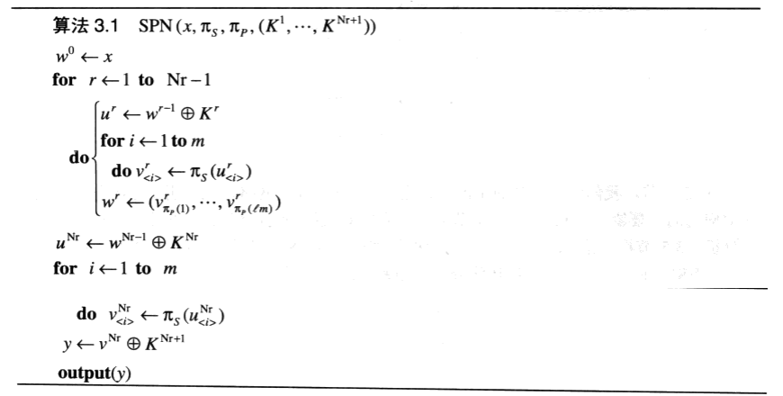
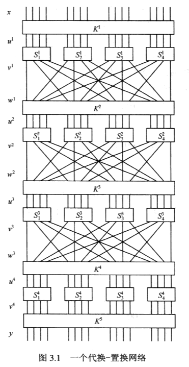
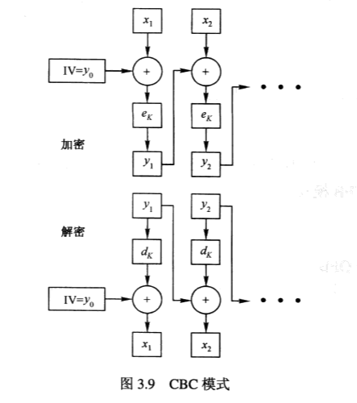
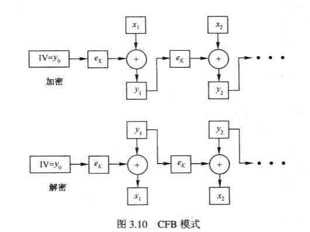

当今大多数的分组密码都是乘积密码。乘积密码通常伴随系列置换与代换操作，常见的乘积密码是迭代密码。

## 3.2 代换-置换网络 (SPN)

一个 SPN 包括两个变换：分别记为 S 和 P。S 叫做 S 盒（S 表示 substitution 代换），它用一个 l 比特向量来替代另一个 l 比特向量。置换 P 用来置换 lm 个比特。

值得注意的是，该 SPN 的第一个和最后一个操作都是异或轮密钥，这叫做白化（whitening）。白化可使一个不知道密钥的攻击者，无法开始进行一个加密或解密操作

## 3.3 线性密码分析

## 3.7 工作模式

### 电码本模式（ECB模式）

这种模式就是一个分组密码的直接使用。ECB 模式的一个明显缺点是在同一密钥下，加密相同的明文分组将会产生相同的密文分组。如果消息分组选自一个“低熵”的明文空间，那么这就是一个严重的弱点。举一个极端的例子，如果明文分组总是由全 0 或全 1 组成，那么 ECB 模式本质上是没用的。

### 密码分组链接模式（CBC模式）

在 CBC 模式中，每一个密文分组 y(i) 在用密钥 K 加密之前，都要先跟下一个明文分组 x(i+1) 相异或。

可以观察到，在 CBC 模式中，如果改变一个明文分组 x(i)，那么 y(i) 及其后所有的密文分组都会受到影响。这一性质说明 CBC 模式适合于认证的目的。更明确地说，这种模式可被用来产生一个消息认证码，即 MAC。这个 MAC 附着在一系列明文分组的后面，它可使 Bob 相信给定的明文序列的确来自 Aice，而且没有被 Oscar 篡改。这样，这个 MAC 保障了消息的完整性。

### 输出反馈模式（OFB模式）

在 OFB 模式中，产生一个密钥流，然后将其与明文相异或（即像流密码一样工作）。

OFB 模式实际上就是一个同步流密码：密钥流由反复加密一个初始向量 IV 而产生。

### 密码反馈模式（CFB模式）

产生一个密钥流，用于一个同步流密码。

### 计数模式（CTR模式）

通过重复加密递增计数器并将生成的数据流与输入进行异或运算，将块密码转换为流密码。

### 计数密码分组链接模式（CCM模式）

CCM 模式基本上是计数模式（用于加密）和 CBC 模式（用于认证）的组合使用
